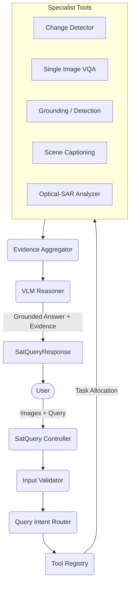

# SatQuery AI Architecture

## Overview
SatQuery AI is an interactive, multimodal remote-sensing assistant that leverages an agentic orchestration layer to route user queries to highly specialized vision and analysis models. 

## System Components

## Data Flow
1. **Input Validation**: The `InputValidator` checks the uploaded images, verifying extensions, extracting structural metadata (dimensions), and ensuring semantic consistency (e.g., verifying that a proposed optical-SAR pair has matching dimensions).
2. **Intent Routing**: The `IntentRouter` processes the natural language query alongside the input configuration to determine the exact workflow (e.g., `change_vqa`, `captioning`, `optical_sar_analysis`).
3. **Tool Execution**: Based on the required tools for the determined intent, the `SatQueryController` executes specialist models (like the baseline Siamese change detector) via the `ToolRegistry`.
4. **Evidence Aggregation**: Raw model outputs (masks, bounding boxes, percent change) are standardized into `Evidence` objects.
5. **VLM Reasoning**: A Vision-Language Model digests the structured `Evidence` to produce a final, coherent, natural language answer.
6. **Execution Trace**: An auditable trace is recorded outlining exactly which models ran, ensuring the user understands how the answer was derived without exposing the hidden AI chain-of-thought.

## Modules
- `src/agent/schemas.py`: Strict data contracts (Pydantic).
- `src/agent/input_validator.py`: Safe ingestion and pairing logic.
- `src/agent/intent_router.py`: Deterministic mapping from queries to workflows.
- `src/agent/tool_registry.py`: Dynamic specialist registration.
- `src/agent/controller.py`: Orchestration of the full pipeline.
- `src/api.py`: FastAPI application wrapping the controller.
